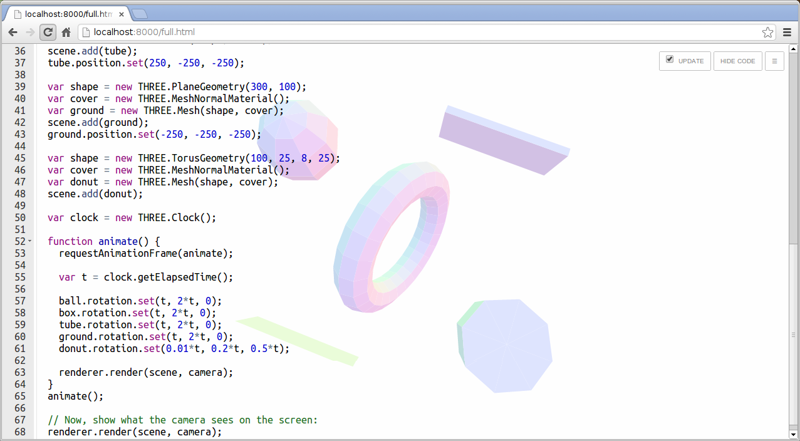

# ICE Code Editor

The Code Editor + Visualization Preview used in the book “[3D Game Programming for Kids](http://gamingjs.com).”

This is an attempt to convert the JavaScript version ([repository](https://github.com/eee-c/code-editor) / [live version](http://gamingjs.com/ice)) to Dart. The JavaScript version is a pain to maintain. I hope to leverage the benefits of Dart (cross-browser support, testing, documentation) by doing this.

## Running the Example App

The example app contained in `example` is a simple Dart web server. From the `example` directory, run the web server with `dart app.dart`, then open `http://localhost:8000` in Dartium. You should see a simple ACE Editor embedded in the page.

## Core Collaborators

 * [Santiago Arias](https://github.com/santiaago)

## Contributors

 * [Kate Bladow](https://github.com/kbladow)
 * [Stephen Cagle](https://github.com/samedhi)
 * [Damon Douglas](https://github.com/damondouglas)
 * [Daniel Gempesaw](https://github.com/gempesaw)
 * [Morgan Nelson](https://github.com/korishev)
 * [Srdjan Pejic](http://batasrki.github.io/)
 * [Michael Risse](https://github.com/rissem)

## Want to Help?

Chris ([twitter](https://twitter.com/eee_c) / [blog](http://japhr.blogspot.com/)) runs nightly (1030pm EDT / 0230 UTC) pairing sessions. [Sign up for free](https://www.google.com/calendar/selfsched?sstoken=UUNwdmNwR09IRm4wfGRlZmF1bHR8NmVjZjU2MGY0MzU4MTBlMjFkZTE0ZDgzYjdkMGU4ZjM) to help out and learn some [Dart](http://dartlang.org)! _Absolutely no experience required. Really :)_
